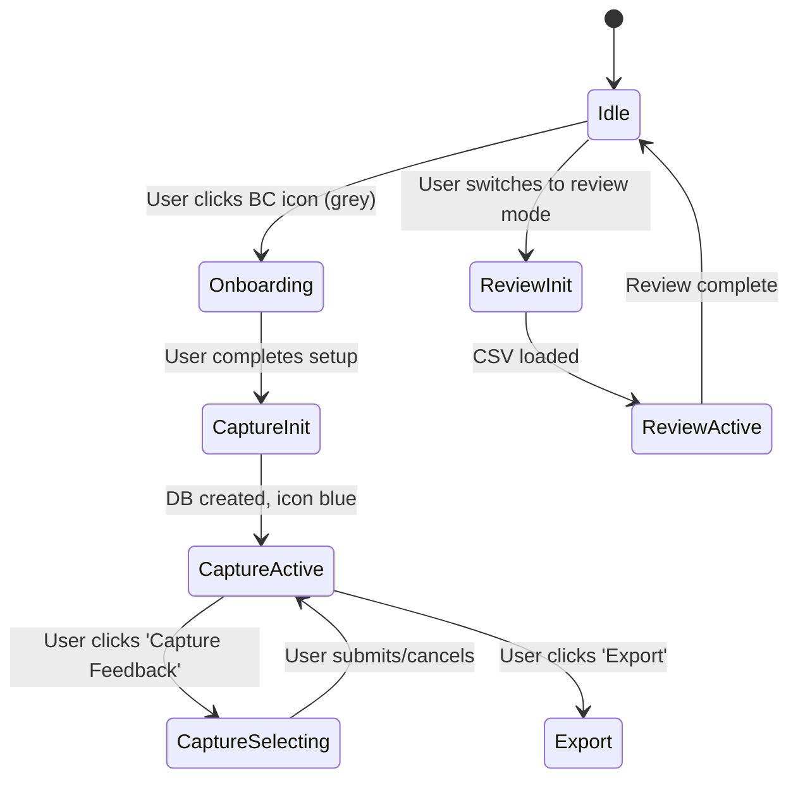

# BackChannel Product Requirements Document (PRD)

## Overview

**BackChannel** is a lightweight JavaScript plugin for capturing and reviewing feedback on static web content, particularly designed for offline or air-gapped environments ("the disconnected web"). It supports feedback workflows across single and multi-page document sets.

---

## Modes

### Capture Mode
Designed for document consumers or reviewers. Enables selection of content and submission of feedback. Default mode.

### Review Mode
Designed for document authors. Loads and manages feedback provided via BackChannel CSV packages.

---

## Features

### Feedback Package Creation

- Initiated from the welcome or home page of the document
- Captures:
  - Document Name (default from `<title>`)
  - Author Name
  - Date
  - Document Path (stemmed URL path)

### Comment Capture Flow

- `BC` icon shows grey by default
- On hover: tooltip guides user
- Click opens onboarding presentation (new window)
- If feedback package exists:
  - Icon is blue
  - Clicking it opens sidebar
  - Shows “Capture feedback” and “Export” buttons
- In Capture mode:
  - Sidebar is hidden
  - Content is highlighted on hover
  - On click/drag: feedback form opens
  - Submit stores comment
  - Cancel or `Esc` exits mode
  - “Cancel capture” button is shown floating top-right

### Sidebar

- Toggle visibility via BC icon
- Displays:
  - List of feedback
  - “Capture Feedback” button
  - “Export” button
- In Review mode:
  - Allows resolution/status change
  - Comments from other pages link via anchor
  - Sidebar persists filters across pages

### Feedback Persistence

- Feedback stored in IndexedDB
- Each document set has its own database
- Database identified via URL root and name
- Current page's database cached in `localStorage` for performance

### Feedback Export

- CSV format
- Human-readable
- Designed for manual transfer
- No online dependencies

### Feedback Import (Review Mode)

- CSV loaded via file selector
- Comments matched by path + anchor
- Sidebar shows list of comments
- Clicking comment navigates to anchor
- If anchor not yet present, is injected at runtime

---

## Planned Enhancements

- Drag-to-reorder comments
- Smart filters (resolved, page, author)
- Comment tagging
- Visual markers on links to other pages with comments
- Role-specific slide-based onboarding
- Local image caching for fully offline exports

---

## Mode Transition Flow (Mermaid)

---

## Architecture Notes

- Plugin is pure JS, deployed as single file
- No server dependencies
- Loads on `window.onload`
- Registers itself via script tag
- IndexedDB per document set
- Uses `localStorage` for performance cache

---

## UI States Summary

- **BC Icon Disabled (grey)**: no feedback package active
- **BC Icon Enabled (blue)**: feedback DB active for current page
- **Sidebar Visible**: comment list, buttons
- **Capture Mode Active**: sidebar hidden, floating Cancel button
- **Export Mode**: sidebar shows CSV generation
- **Review Mode**: shows all comments, resolve controls
